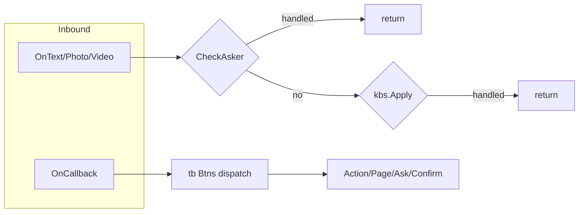

# tb_start：面向 AI 编程助手的开发说明

本文档供 Cursor 等 Agent 在基于 **tb_start** 模板开发 Telegram Bot 时使用。目标是：**优先使用 `github.com/xnumb/tb` 已提供的类型与函数**，避免在业务里重复实现与框架等价的逻辑。

**版本基准（以本仓库 `go.mod` 为准）**

| 依赖 | 版本 |
|------|------|
| `github.com/xnumb/tb` | v1.0.8 |
| `gopkg.in/telebot.v4` | v4.0.0-beta.7 |

更细的 API 以 `tb` 模块源码为准；本地路径示例：`/Users/numbx/dev/tb_template/tb/`。

---

## 1. 一句话原则

- **发送 UI**：用 `tb.Send`、`tb.SendParams`（及 `SendText` / `ReplyText` / `SendErr` 等），不要默认直接 `c.Send` 拼消息与键盘。
- **内联按钮**：框架已在 `tele.OnCallback` 上统一解析 `Data`。业务按钮必须在 `tb.Btns` 里注册 `*tb.Btn`，并用 `G` / `P` / `T` / `TP` 生成 `tele.Btn`。不要手写 `id>page:arg1,arg2` 字符串（除非你完全理解长度限制与系统前缀，见下文 `Cmd` 约定）。
- **需要底层能力**：通过 `(*tb.Tbot).Client()` 取得 `*tele.Bot`，再 `Handle` 额外事件类型。
- **参考真实分层（可选 `read_file`）**：`vip_chaqun/serv`、`tg_archive_260115/btc_cai/serv` 中的 `Entry.*`、`conf.*`、`*.btn.go`、`*.send.go` 拆分方式与 tb_start 一致思路。

---

## 2. tb_start 目录约定（Agent 应改哪里）

| 路径 | 职责 |
|------|------|
| `main.go` | `mod.Reset()` → `serv.Gen(app.Conf.Token)` → `b.Start()`；单 Bot 默认入口。 |
| `app/conf.go` | `conf.yaml` 解析；常量 `BtnExpireMin`、`AskExpireMin`（按钮消息过期、Ask 状态过期）。 |
| `mod/sys.db.go` | GORM、`Ask` 表实现 `tb.Asker`（`Set` / `Get` / `Done`），供 `LinkAsk` 与 `CheckAsker` 使用。 |
| `mod/sys.conf.go` 等 | `AutoMigrate` 模型列表。 |
| `serv/Entry.go` | `Gen(token)` 内 `tb.New(tb.InitParams{...})`、`SetMenus`、对 `OnText` / `OnPhoto` / `OnVideo` 注册 `kbs.Apply`、`btns.CheckAsker`。 |
| `serv/Entry.menu.go` | 聚合 `tb.Menus`。 |
| `serv/Entry.btn.go` | 聚合 `tb.Btns`（可再拆 `conf.btn.go` 等）。 |
| `serv/Entry.kb.go` | 聚合 `tb.Kbs` 与 `tb.Kbts`。 |
| `_tbots.go` | **与默认 `main.go` 二选一**：多 Bot 时用 `tb.NewTbots` + `Start` / `Stop` / `Get`，不是单文件双 `main` 并存。 |

---

## 3. 初始化 `tb.New(tb.InitParams)`

`InitParams`（`tb/tbot.go`）字段含义：

| 字段 | 说明 |
|------|------|
| `Token` | Bot Token。 |
| `Proxy` | 非空时通过 HTTP 代理创建 `http.Client` 传给 telebot。 |
| `AllowUpdates` | 长轮询允许的 update 类型。预置：`tb.AllowUpdatesLow`（message + callback_query）、`AllowUpdatesNormal`、`AllowUpdatesHigh`（见 `tbot.go` 注释完整列表）。 |
| `Asker` | 实现 `tb.Asker`（见 `tb/tbot.go`）：`Get(senderId int64) string`、`Set(senderId int64, cmd string, messageId int) error`、`Done(senderId int64) (int, error)`。多步问答必填；tb_start 用 `mod.Ask`。 |
| `BtnExpireMin` | `>0` 时，内联按钮所在消息超过该分钟数会 `RespondAlert("按钮已过期")`。`0` 表示不检测。 |
| `Btns` | 所有内联按钮定义切片 `tb.Btns`，由框架统一 `OnCallback` 分发。 |

框架默认：`ParseMode = tele.ModeHTML`（`tb.New` 内 `tele.Settings`）。

---

## 4. `*tb.Tbot` 方法（`tb/client.go`）

| 方法 | 用途 |
|------|------|
| `Client() *tele.Bot` | 注册额外 Handler、直接调 telebot API。 |
| `SetMenus(menus tb.Menus, userId int64)` | 注册菜单命令并 `Handle("/"+Menu.ID, Fn)`，并 `SetCommands`；`userId!=0` 时用于设置该用户的菜单按钮。 |
| `Start()` | 阻塞启动 `client.Start()`。 |
| `SendTo` / `SendToTopic` / `SendToUsername` | 主动向指定 chat / 话题 / @用户名发送，参数为 `tb.SendParams`。 |
| `SendAlbum` | 按 `info` + `medias` 字符串发相册（与 `BuildAlbum` 约定一致）。 |
| `DelMessageFrom(chatId, messageId)` | 封装 `deleteMessage` Raw API。 |

---

## 5. 按钮子系统：`Btn` / `Btns`（`tb/btn.go`）

### 5.1 `Btn` 字段

| 字段 | 说明 |
|------|------|
| `ID` | 命令 ID，与 `genCmd` 中 id 一致；用于回调分发匹配。 |
| `Text` | 默认按钮文案；空则不能用 `G`/`P`/`T`/`TP` 生成合法按钮。 |
| `Args` | 参数名列表；生成按钮时传入的实参个数必须一致，回调里映射为 `tb.Args`。 |
| `Respond` | 为 `true` 时由你在回调里自行 `c.Respond()`；否则框架在部分分支会先 `Respond()`。 |

### 5.2 链式绑定（四选一，互斥业务语义）

| 方法 | 回调类型 | 说明 |
|------|----------|------|
| `Link(Action)` | `Fn(c, args Args) error` | 普通内联按钮。 |
| `LinkPage(PageAction)` | `Fn(c, page int, args Args) error` | 分页；`page` 来自 `Data` 中 `>` 后数字。 |
| `LinkAsk(AskAction)` | `Q` + `Fn(c, val, args) (done bool, err error)` | 多步输入；配合 `Asker` 与 `Btns.CheckAsker`。 |
| `LinkConfirm(ConfirmAction)` | `Q` + `Fn` + `CancelFn` | 确认/取消；框架注入 `_confirmed.` / `_cancelConfirm.` 前缀（见 `client.go`）。 |

`AskAction`：`IsEdit` 是否编辑当前消息提问；`KeepQuiz` 为 true 时默认不删提问消息相关逻辑见 `CheckAsker`。

`ConfirmAction`：`IsSend` 与确认面板是否「新发消息」相关（默认偏编辑当前消息语义，见 `SendConfirm`）。

### 5.3 生成 `tele.Btn`

| 方法 | 含义 |
|------|------|
| `G(args...)` | 当前页 `page=0`，文案 `Text`。 |
| `P(page, args...)` | 指定页码（`LinkPage` 必填 `page>0`）。 |
| `T(text, args...)` | 临时改文案。 |
| `TP(text, page, args...)` | 临时文案 + 页码。 |

### 5.4 定义习惯：`_btnName` 与 `btnName` 成对（避免初始化循环依赖）

在 `btc_cai`、`vip_chaqun` 等项目中，常见写法是**两个包级变量**：

1. **`_btnXxx`**：只填 `ID` / `Text` / `Args` 的「裸」`*tb.Btn`，**不要**在这里 `Link`。
2. **`btnXxx`**：`_btnXxx.Link` / `LinkPage` / `LinkAsk` / `LinkConfirm` 的结果，放进 `tb.Btns`，供框架根据回调 `Data` 分发。

**为什么要拆？** `Link*` 里的 `Fn` 往往会调用同包下的 `sendYyy`、`queryZzz`。而 `sendYyy` 组装 `SendParams.Rows` 时又要调用 `_btnXxx.G()` / `P()` / `T()` / `TP()` 生成 `tele.Btn`。若只用**一个**变量并在定义时完成 `Link`，容易出现包级 `var` **初始化顺序**问题或**循环引用**（`btn` → 闭包 → `send` → `btn`）。把「可生成 `tele.Btn` 的底座」放在 `_btnXxx`，把「带回调、须注册进 `Btns`」放在 `btnXxx`，`send` 里**只引用 `_btnXxx`**，即可打破环。

**Agent 规则摘要**：

- 在 `*.send.go` 里拼键盘行：优先用 **`_btnXxx.G` / `P` / `T` / `TP`**。
- 在 `Entry.btn.go`（或聚合的 `btns` 切片）里：只收录 **`btnXxx`**（已 `Link*` 的指针）。

示例（与 `btc_cai/serv/admin.btn.go` 一致）：

```go
var _btnAgents = &tb.Btn{
	ID: "agents",
}
var btnAgents = _btnAgents.LinkPage(tb.PageAction{
	Fn: func(c tele.Context, page int, args tb.Args) error {
		return sendAgents(c, true, page)
	},
})
```

### 5.5 系统常量与预制按钮

| 符号 | 含义 |
|------|------|
| `tb.CmdEmpty` | 占位回调，无操作。 |
| `tb.CmdDel` | 删除消息；预制 `tb.BtnDelMessage`（「关闭」）。 |
| `_cancelAsk` | Ask 流程取消（内部）。 |
| `_confirmed.{id}` / `_cancelConfirm.{id}` | Confirm 流程（内部拼接）。 |

### 5.6 `Btns.CheckAsker`

必须在用户可能回复文本/媒体的路径调用，例如 `OnText`、`OnPhoto`、`OnVideo`（见 `serv/Entry.go`）。若当前用户在 `Asker` 中有未完成命令，会路由到对应 `LinkAsk` 的 `Fn`。

### 5.7 错误变量

- `tb.ErrBtnDefinedInvalid`
- `tb.ErrBtnArgsCountInvalid`

---

## 6. `SendParams` 与发送函数族（`tb/send.go`）

### 6.1 `SendParams` 字段

| 字段 | 说明 |
|------|------|
| `IsEdit` | 编辑当前消息发送。 |
| `IsReply` | 回复当前消息。 |
| `Info` | 文本或媒体 `Caption`（HTML 与全局 ParseMode 一致）。 |
| `HeadRows` / `Rows` / `FootRows` | 内联键盘上、中、下三块行。 |
| `Page` | 分页信息（`SendPage`）。 |
| `Pic` / `Vod` | 图片或视频：`https://` URL、含 `.` 的路径、`fileId`；视频 fileId 可配合内部逻辑使用。 |
| `KbBtns` | `[][]string` 回复键盘（非内联），会 `ResizeKeyboard`。 |
| `RawMarkup` | 若非 nil，直接使用该 `ReplyMarkup`，忽略 Rows/KbBtns 构建逻辑。 |

### 6.2 `SendPage`

| 字段 | 说明 |
|------|------|
| `No` / `Count` | 当前页、总页数。 |
| `Total` | 数据总条数（展示用）。 |
| `CmdId` / `CmdArgs` | 翻页按钮回传的命令 ID 与参数。 |
| `EmptyText` / `IgnoreEmpty` | 无数据时按钮文案或忽略空状态行。 |
| `NumMode` | `true` 为数字页签；`false` 为上一页/下一页 + 「第 x/y 页」。 |

### 6.3 常用函数

| 函数 | 说明 |
|------|------|
| `tb.Send(c, p, opts...)` | 核心发送入口。 |
| `tb.SendText` / `tb.ReplyText` | 纯文本快捷方式。 |
| `tb.SendErr` | 打日志并向用户发错误提示（带 `emj.Bell`）。 |
| `tb.Alert` / `tb.Toast` | 回调 `RespondAlert` / `RespondText`。 |
| `tb.DelMessage` / `tb.DelMessageFrom` | 删除消息。 |
| `tb.SendTo` / `SendToTopic` / `SendToUsername` | 需 `Context` 内 `Bot` 的发送。 |
| `tb.SendAlbum` / `tb.SendAlbumTo` | 媒体组。 |
| `tb.BuildSend` / `tb.BuildAlbum` | 仅需构造 telebot 参数时使用。 |
| `tb.ReceiveMedia(c)` | 从消息取 `(text, mediaId)`；视频 `mediaId` 前缀 `_`。 |
| `(*SendParams).SetMedia(text, mediaId, btns, needDelBtn)` | 用媒体 + 可选 URL 按钮串填充 `SendParams`。 |

**实现提示**：若视频通过 URL/本地路径发送异常，可对照 `send.go` 中 `buildSend` 视频分支源码（其中 URL/磁盘判断曾使用 `p.Pic` 变量，易与 `p.Vod` 混淆）；优先用 `fileId` 或向框架提修复。

---

## 7. 命令串与 `Args`（`tb/cmd.go`、`tb/args.go`）

### 7.1 `Data` 格式（框架内部）

`id>page:arg1,arg2,...`

- Telegram 限制 callback `Data` **最长 64 字符**；超长会 `ErrCmdMaxLen` 日志。
- 解析：`parseCmd` → `id`、`page`、`[]string` args。

### 7.2 `Args` map 辅助

| 方法 | 说明 |
|------|------|
| `Get(k)` | string |
| `GetB(k)` | bool（经 `to.B`） |
| `GetI` / `GetI64` / `GetU` / `GetF` | 数值解析，第二个返回值为是否成功 |

### 7.3 错误变量

- `tb.ErrCmdMaxLen`
- `tb.ErrCmdInvalidPage`

---

## 8. 文案与分组行（`tb/str.go`）

| 函数 | 用途 |
|------|------|
| `Info(title, lines...)` | 标题 + 多行正文拼接。 |
| `Infos(lines...)` | 多行 `\n` 连接。 |
| `WrapTitle(title, emoji, count)` | 标题两侧 emoji；`count==0` 时按标题长度自动对称 padding。 |
| `BoolStr` / `CheckStr` / `RadioStr` | 布尔展示文案。 |
| `GroRow` / `GroRowFmt` | 生成占满一行的「分组标题」式 `tele.Row`（`Data` 为 `CmdEmpty`）。 |

---

## 9. 回复键盘（`tb/kb.go`）

| 类型 | 说明 |
|------|------|
| `Kbts` | `[][]string`，用于 `SendParams.KbBtns`。 |
| `Kb` / `Kbs` | 文本命令：`Text` 精确匹配时执行 `Fn`；`Kbs.Apply(c)` 返回是否已处理。 |

---

## 10. 命令菜单（`tb/menu.go`）

| 类型 | 说明 |
|------|------|
| `Menu` | `ID`（命令名，不含 `/`）、`Desc`、`Fn`。 |
| `Menus` | 切片。 |
| `(*Tbot).SetMenus` | 注册 `/ID` 与 BotFather 可见命令列表。 |

---

## 11. 相册：`AlbumManager`（`tb/album.go`）

| API | 说明 |
|-----|------|
| `tb.NewAlbumManager()` | 创建管理器；内部有定时清理协程。 |
| `(*AlbumManager).Handle(c, fn)` | 按 `AlbumID` 聚合多图/视频；约 2 秒无新消息则 `fn(tb.Album)`。 |
| `Album` | 含 `Tid`、`List`（fileId 列表，视频带 `_` 前缀）、`Text`、`CreatedAt`。 |

与 `BuildAlbum` / `SendAlbum` 的 `medias` 约定一致：**逗号分隔**多个 fileId，视频项加 **`_` 前缀**。

---

## 12. 多 Bot：`Tbots`（`tb/bots.go`）

| API | 说明 |
|-----|------|
| `tb.NewTbots(gen func(token string) *Tbot, onStart func(id uint, u *tele.User))` | `gen` 返回 nil 表示失败。 |
| `Start(id uint, token string) bool` | 已存在同 id 返回 false；成功则 `go b.Start()`。 |
| `Stop(id uint)` | `Stop` bot 并 `onStart(id, nil)`。 |
| `Get(id uint) *Tbot` | 取实例。 |
| `tb.ErrBotStartFailed` | 启动失败相关日志场景使用。 |

---

## 13. 子包速查（import 路径）

| 包 | 常用符号 | 典型场景 |
|----|----------|----------|
| `github.com/xnumb/tb/to` | `S`、`Sf`、`I`、`U`、`I64`、`F`、`B` | 回调参数与字符串互转。 |
| `github.com/xnumb/tb/log` | `Info`、`Warn`、`Debug`、`Err`、`Fatal` | 日志；`Err`/`Fatal` 支持 `Err, "key", val` 键值对。 |
| `github.com/xnumb/tb/utils` | `ParseYaml`、`GetNow`（`Asia/Shanghai`）、`RandStr`、`Md5`、`Hex`、`CheckVarcharLen`、`GetPrefixCmdVal`、`CheckBotTokenFmt`、`GenUrlBtns`、`BtnsFormatIntro`、`ExecShell` | 配置、时间、字符串、URL 按钮解析、Shell（写 `command_output.log`）。 |
| `github.com/xnumb/tb/fetch` | `Get`、`Post`、`Params`、`Header`、`Body`、`Body.Parse` | JSON HTTP；`Content-Type: application/json`。 |
| `github.com/xnumb/tb/fetch` | `ErrRequestNotFound` | 请求体构造异常。 |
| `github.com/xnumb/tb/emj` | 大量 `const` 表情符号 | UI 文案前缀；完整列表见 `tb/emj/emoji.go`（Favorite / Common / Direction / Color / Num 等分组）。 |
| `github.com/xnumb/tb/tronGrid` | `New(key, debug)`、`Client`、`Token`、`GetUsdtHistory`、`GetNowBlock`、`GetBlockByNum`、`GetTransactionInfoById`、`CheckAddrFmt`、`CheckAddrActive` | TRON 主网/测试网（`debug` 切换 Shasta）；类型含 `RespTrc20HistoryItem`、`Block`、`Transaction`、`TransactionInfo`、`Tx`/`Txs` 等（见 `resp.go` / `utils.go`）。 |

---

## 14. 反模式（Agent 应避免）

1. 手写 callback `Data`，不加入 `tb.Btns`。
2. 多步问答不用 `LinkAsk` + `tb.Asker` 实现 + `Btns.CheckAsker`。
3. 分页列表不用 `SendPage` + `LinkPage`。
4. 需要确认/取消不用 `LinkConfirm`。
5. 重复调用 Raw `deleteMessage` 而忽略 `DelMessageFrom` / `Tbot.DelMessageFrom`。
6. 媒体组场景忽略 `BuildAlbum` / `SendAlbum` / `AlbumManager`。
7. 在 `InitParams` 之外再注册第二个 `OnCallback` 覆盖框架分发（除非你很清楚冲突后果）。
8. 只用**一个**包级 `btn` 同时承担 `Link`（回调里调 `send`）又在 `send` 里用其 `G`/`P` 拼行，触发 **`initialization cycle`** 或难以控制的 `var` 顺序；应拆成 **`_btn` + `btn`**（见 §5.4）。

---

## 15. 与 `telebot.v4` 的关系

- `tb` 基于 `gopkg.in/telebot.v4`；本模板 `go.mod` 中 telebot 版本可与 `tb` 依赖的 beta 版本不完全一致，升级时需自行跑通编译与行为回归。
- 类型 `tele.Context`、`tele.Bot`、`tele.Row`、`tele.Btn` 等均来自 telebot。

---

## 16. 消息处理流（附录）



---

## 17. 最小代码示例

### 17.1 初始化与注册（对齐 `serv/Entry.go` 思路）

```go
t, err := tb.New(tb.InitParams{
    Token:        token,
    AllowUpdates: tb.AllowUpdatesHigh,
    Proxy:        app.Conf.Proxy,
    BtnExpireMin: app.BtnExpireMin,
    Asker:        mod.Ask{},
    Btns:         btns,
})
if err != nil {
    log.Fatal(err)
}
t.SetMenus(menus, 0)
t.Client().Handle(tele.OnText, func(c tele.Context) error {
    if c.Message().Private() {
        if kbs.Apply(c) {
            return nil
        }
        if btns.CheckAsker(c, mod.Ask{}) {
            return nil
        }
    }
    return nil
})
```

### 17.2 分页 + 发送

```go
import (
    "github.com/xnumb/tb"
    "github.com/xnumb/tb/emj"
    "github.com/xnumb/tb/to"
    tele "gopkg.in/telebot.v4"
)

p := tb.SendParams{
    Info: tb.Info("列表示例", "共 "+to.S(total)+" 条"),
    Page: &tb.SendPage{
        No: page, Count: pageCount, Total: total,
        CmdId: "MyList", CmdArgs: []string{filterId},
        EmptyText: emj.Empty + " 暂无数据",
    },
    Rows: []tele.Row{
        {myBtn.P(page, filterId)},
    },
}
return tb.Send(c, p)
```

（`myBtn` 为已 `LinkPage` 的 `*tb.Btn`；`total` 为 `int64` 等与 `to.S` 泛型匹配的类型。）

### 17.3 Ask 按钮定义（概念）

```go
var btnSetName = (&tb.Btn{
    ID:   "SetName",
    Text: "设置名称",
    Args: []string{"userId"},
}).LinkAsk(tb.AskAction{
    Q: func(c tele.Context, args tb.Args) string {
        return "请输入新名称："
    },
    Fn: func(c tele.Context, val string, args tb.Args) (bool, error) {
        // 校验 val，写入 DB；返回 done=true 结束 Ask
        return true, nil
    },
})
```

---

## 18. 推荐阅读顺序（Agent）

1. 本仓库 `serv/Entry.go`、`serv/Entry.menu.go`、`serv/Entry.btn.go`、`mod/sys.db.go`（`Ask`）。
2. `github.com/xnumb/tb` 源码：`tbot.go`、`client.go`、`btn.go`、`send.go`、`cmd.go`。
3. 参考项目：`/Users/numbx/dev/vip_chaqun/serv/`、`/Users/numbx/dev/tg_archive_260115/btc_cai/serv/`（目录以你本机为准）。

按上述顺序实现新功能时，优先搜索 `tb.` 是否已有封装，再考虑扩展 `Client().Handle`。
